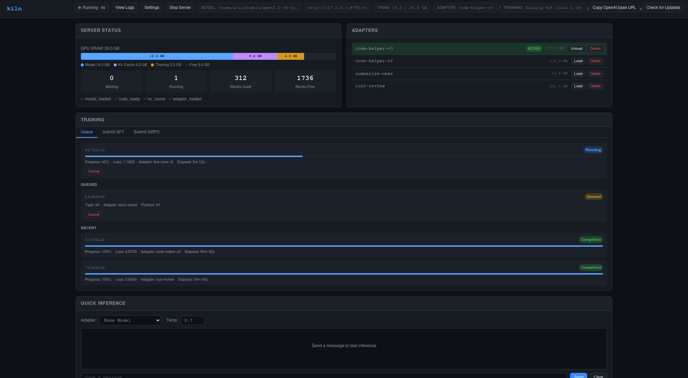
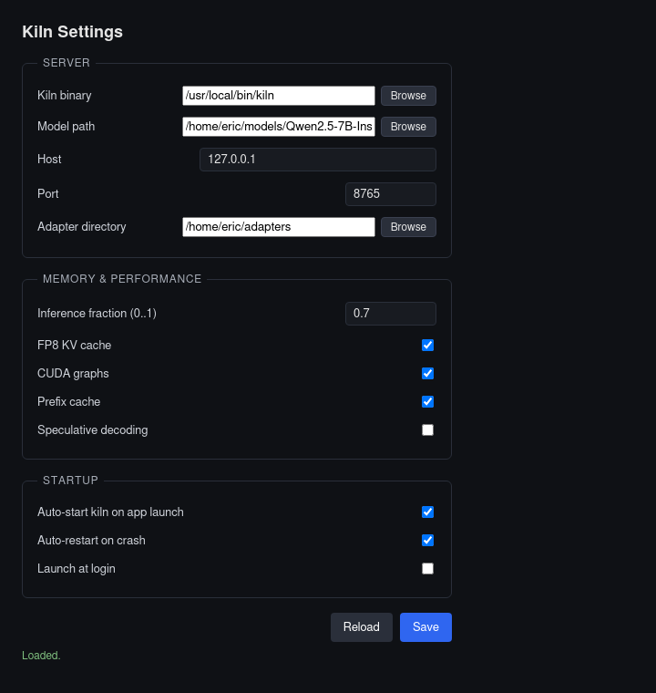
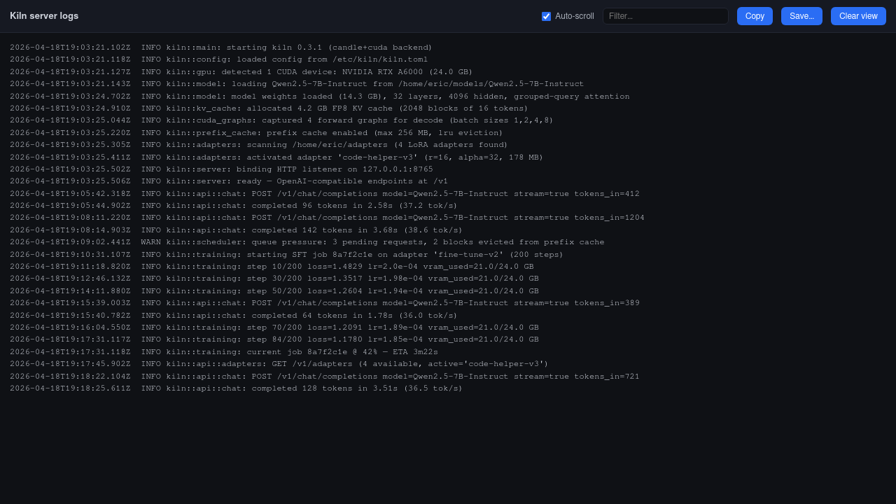

<p align="center">
  
</p>

<h1 align="center">Kiln</h1>

<p align="center">
  <strong>Your model gets better every time you use it.</strong><br>
  A single-GPU inference server with live LoRA training. Pure Rust. Single binary.
</p>

<p align="center">
  <a href="https://ericflo.github.io/kiln/">Website</a> &middot;
  <a href="docs/site/demo/">Demo</a> &middot;
  <a href="QUICKSTART.md">Quickstart</a> &middot;
  <a href="https://ericflo.github.io/kiln/troubleshooting.html">Troubleshooting</a> &middot;
  <a href="ARCHITECTURE.md">Architecture</a> &middot;
  <a href="kiln.example.toml">Configuration</a> &middot;
  <a href="CHANGELOG.md">Changelog</a> &middot;
  <a href="CONTRIBUTING.md">Contributing</a> &middot;
  <a href="LICENSE">License</a>
</p>

---

Kiln serves a language model and trains it — in the same process, on the same GPU, at the same time. You submit corrections or scored completions over HTTP, and the model improves in seconds. No restarts, no separate training pipeline, no second copy of the weights.

It targets one model ([Qwen3.5-4B](https://huggingface.co/Qwen/Qwen3.5-4B)) and optimizes everything for that model — the scheduler, the memory manager, the kernels. This isn't a general-purpose framework. It's a scalpel.

## Why

Today, improving a deployed model looks like: collect failure examples, format them, upload to a training service, wait hours, download new weights, redeploy, hope. Kiln collapses that into one API call:

```bash
# Submit a correction — the model learns it in seconds
curl http://localhost:8420/v1/train/sft \
  -H "Content-Type: application/json" \
  -d '{
    "examples": [
      {"messages": [
        {"role": "user", "content": "Summarize this contract clause..."},
        {"role": "assistant", "content": "The clause establishes..."}
      ]}
    ]
  }'

# The next request already uses the updated weights
curl http://localhost:8420/v1/chat/completions \
  -H "Content-Type: application/json" \
  -d '{"messages": [{"role": "user", "content": "Summarize this contract clause..."}]}'
```

A 4B model continuously tuned to your specific workload will outperform a generic 70B model on the tasks you actually care about. And it runs on hardware you already own.

## Features

- **OpenAI-compatible API** — drop in as a local replacement. SSE streaming, chat completions, tool use formatting.
- **SFT training** over HTTP — submit examples, model updates in seconds via LoRA hot-swap.
- **GRPO training** over HTTP — submit scored completions for reinforcement learning. You control the reward function.
- **LoRA hot-swap** — new adapter weights activate atomically at iteration boundaries. Zero downtime.
- **Continuous batching** with chunked prefill — decode requests are never stalled by long prompts.
- **128K+ context** on 24GB — Qwen3.5-4B's hybrid architecture (24 linear attention + 8 full attention layers) means KV cache is 4x smaller than a pure transformer.
- **Paged KV cache** — virtual memory-style block allocation eliminates fragmentation.
- **FP8 KV cache** — optional quantization doubles effective context length.
- **Prefix caching** — shared prompt prefixes reuse cached KV blocks.
- **Gradient checkpointing** — training fits on consumer 24GB GPUs (RTX 3090/4090).
- **Adapter management** — load, unload, upload (import), download (export), and version LoRA adapters.
- **Adapter composition** — stack multiple LoRAs per request with per-adapter scaling, or merge them server-side via weighted_average / TIES / concatenation.
- **Embedded web dashboard** at `/ui` — live server status, VRAM breakdown, adapter management, training monitoring, and a chat playground. No extra service to run.
- **Prometheus metrics** at `/metrics` — request latency, throughput, training progress, memory usage.
- **Training webhooks** — POST a JSON event to a configured URL on training job completion or failure.
- **Pure Rust** — single binary, single process. No Python. No sidecar. No second model in memory.

## The GRPO Loop

This is the killer feature. Generate completions, score them with your own reward function, and feed the results back. The model learns what "good" means for your use case.

```python
import openai

client = openai.OpenAI(base_url="http://localhost:8420/v1", api_key="unused")

# 1. Generate candidates
responses = [
    client.chat.completions.create(
        model="qwen3.5-4b-kiln",
        messages=[{"role": "user", "content": prompt}],
        temperature=0.7
    )
    for _ in range(8)
]

# 2. Score them however you want — regex, unit tests, another model, human eval
scored = [{"text": r.choices[0].message.content, "reward": my_score(r)} for r in responses]

# 3. Submit — the server trains and hot-swaps immediately
requests.post("http://localhost:8420/v1/train/grpo", json={
    "groups": [{
        "messages": [{"role": "user", "content": prompt}],
        "completions": scored,
    }]
})

# 4. Next inference already uses the improved weights
```

See [docs/GRPO_GUIDE.md](docs/GRPO_GUIDE.md) for worked verifiable-rewards examples (math, JSON, code).

## Quick Start

**Supported hardware:** NVIDIA GPU with 24GB+ VRAM and CUDA 12+ **or** Apple Silicon Mac with 16GB+ unified memory. Kiln targets `Qwen/Qwen3.5-4B` and needs about 20GB of free disk for the server, model weights, and adapters.

**Path 1 — Desktop App / prebuilt binary, recommended for most users:** Install [Kiln Desktop](#desktop-app) on Windows, Linux, or macOS. The app downloads and verifies the matching prebuilt `kiln` server binary on first launch, then walks you through choosing or downloading the model weights. No Rust toolchain, CUDA toolkit, or source build is required for this path.

If you prefer a terminal, pull a prebuilt container instead:

```bash
docker pull ghcr.io/ericflo/kiln-server:latest
```

**Path 2 — Source / CLI, for contributors and direct CLI users:** Install Rust stable, then build the CLI from source for your platform.

```bash
git clone https://github.com/ericflo/kiln.git
cd kiln

# Linux / Windows + NVIDIA
cargo build --release --features cuda     # ~15-30 min first build (CUDA kernels)

# macOS + Apple Silicon
cargo build --release --features metal    # Metal backend via candle
```

Download the model weights:

```bash
pip install huggingface-hub
huggingface-cli download Qwen/Qwen3.5-4B --local-dir ./Qwen3.5-4B
```

Start the source-built server:

```bash
KILN_MODEL_PATH=./Qwen3.5-4B ./target/release/kiln serve
```

```
  ┌─────────────────────────────────────┐
  │           🔥 K I L N 🔥             │
  │   inference · training · adapters   │
  └─────────────────────────────────────┘

  Version: 0.2.13
  Model:   ./Qwen3.5-4B
  CUDA:    available ✓
  GPU:     NVIDIA RTX A6000
  VRAM:    49140 MiB total, 48891 MiB free
  Listen:  http://127.0.0.1:8420
```

The `GPU` and `VRAM` lines come from `nvidia-smi` and are skipped silently if it isn't installed.

```bash
# Chat
curl http://localhost:8420/v1/chat/completions \
  -H "Content-Type: application/json" \
  -d '{"messages": [{"role": "user", "content": "Hello!"}], "stream": true}'

# Train
curl http://localhost:8420/v1/train/sft \
  -H "Content-Type: application/json" \
  -d '{"examples": [{"messages": [{"role": "user", "content": "Hi"}, {"role": "assistant", "content": "Hey there!"}]}]}'

# Check training
curl http://localhost:8420/v1/train/status
```

See [QUICKSTART.md](QUICKSTART.md) for the full walkthrough including Desktop App setup, source builds, GRPO, adapter management, Docker, and systemd setup. If setup stalls on binary downloads, CUDA/Metal, model paths, `/health`, mock mode, training endpoints, or adapter directories, start with the [Troubleshooting guide](https://ericflo.github.io/kiln/troubleshooting.html). For tools-bearing workloads on older pinned releases, see [QUICKSTART.md §4.2](QUICKSTART.md#42-troubleshooting-older-release-long-prefill-timeouts) for the legacy `workers=1` / request-timeout troubleshooting note ([#664](https://github.com/ericflo/kiln/issues/664)).

## See it in action

A 60-second asciicast captured on a single A6000 against `Qwen3.5-4B` walks the full live-LoRA online-learning loop: cold start → first chat (base model) → `POST /v1/train/sft` correction → hot-swap → second chat (improved). Watch it in the embedded player at **[ericflo.github.io/kiln/demo/](https://ericflo.github.io/kiln/demo/)** or browse the recording script and reference shell driver under [`docs/site/demo/`](docs/site/demo/).

The kiln server also ships an embedded web dashboard at `http://localhost:8420/ui` with live decode tok/s, p50/p99 ITL, VRAM breakdown, adapter management, training monitoring, and a chat playground — no extra service to run.

## Memory Budget (24GB GPU)

Qwen3.5-4B's hybrid architecture is the key. Only 8 of 32 layers need KV cache, so long-context inference costs a fraction of what a pure transformer would.

| Scenario | Total VRAM | Fits 24GB? |
|---|---|---|
| 128K context, 1 sequence, inference only | ~13 GB | Yes |
| 128K context, 1 sequence, inference + training | ~18 GB | Yes |
| 64K context, 4 sequences, inference + training | ~22 GB | Yes |
| 32K context, 8 sequences, inference + training | ~22 GB | Yes |
| 128K context, 4 sequences, FP8 KV cache | ~19 GB | Yes |

### Apple Silicon (M3 Max / M4 Max 64GB unified memory)

On Apple Silicon, model weights, KV cache, and training state all live in unified memory shared with the OS. A 64 GB chip leaves generous headroom for long contexts and concurrent training.

| Scenario | Unified Memory | Fits 64GB? |
|---|---|---|
| 128K context, 1 sequence, inference only | ~13 GB | Yes |
| 128K context, 1 sequence, inference + training | ~18 GB | Yes |
| 64K context, 4 sequences, inference + training | ~22 GB | Yes |
| 128K context, 8 sequences, inference + training | ~32 GB | Yes |
| 128K context, 4 sequences, FP8 KV cache | ~19 GB | Yes |

16 GB M-series chips fit short-context inference; 32 GB fits 64K context comfortably; 64 GB+ matches or exceeds the 24 GB CUDA envelope.

## API

| Method | Path | Description |
|---|---|---|
| POST | `/v1/chat/completions` | Chat completions (OpenAI-compatible) |
| POST | `/v1/completions/batch` | Batch generation API for GRPO (up to 64 prompts per request) |
| POST | `/v1/train/sft` | Submit SFT training examples |
| POST | `/v1/train/grpo` | Submit GRPO scored completions |
| GET | `/v1/train/status` | Training queue and job status |
| GET | `/v1/adapters` | List loaded LoRA adapters |
| POST | `/v1/adapters/load` | Load adapter from disk |
| POST | `/v1/adapters/unload` | Unload active adapter |
| POST | `/v1/adapters/upload` | Multipart tar.gz import of an adapter |
| GET  | `/v1/adapters/{name}/download` | Stream adapter as tar.gz (export) |
| POST | `/v1/adapters/merge` | Merge adapters (weighted_average, TIES, or concatenation modes) |
| GET | `/v1/models` | List available models |
| GET | `/ui` | Embedded web dashboard (status, adapters, training, chat) |
| GET | `/health` | Server health and diagnostics |
| GET | `/metrics` | Prometheus metrics |

## Architecture

```
Single Rust binary:
  HTTP (axum) ─── Scheduler (continuous batching, chunked prefill)
                      │
                  Block Manager (paged KV cache)
                      │
                  Engine (model forward + LoRA)
                  ├── 24× Gated DeltaNet layers (linear attention, O(1) state)
                  └──  8× GQA layers (full attention + KV cache)
                      │
                  Training (background thread, shares GPU memory)
                  ├── SFT (cross-entropy on LoRA parameters)
                  └── GRPO (advantage-weighted policy gradient)
```

Everything runs in one process. Training happens on a background thread sharing the already-loaded model — no second copy in VRAM, no Python sidecar.

See [ARCHITECTURE.md](ARCHITECTURE.md) for the full deep-dive.

## Project Structure

```
crates/
  kiln-core/             Core types: block manager, prefix cache, config, request lifecycle
  kiln-model/            Model loading, forward pass, LoRA, sampling
  kiln-scheduler/        Continuous batching scheduler with chunked prefill
  kiln-server/           HTTP server, CLI, training queue, metrics, config
  kiln-train/            SFT and GRPO training loops with gradient checkpointing
  kiln-nvtx/             Thin NVTX range wrapper for nsys attribution (no-op when off)
  kiln-flce-kernel/      Fused Linear Cross-Entropy (chunked CE without [T, V] logits)
  kiln-flash-attn/       Vendored Flash-Attention-2 CUDA kernels (C-ABI + Rust FFI) [CUDA only]
  kiln-gdn-kernel/       Vendored Gated DeltaNet chunkwise + recurrent kernels [CUDA only]
  kiln-conv1d-kernel/    Vendored mamba-ssm causal_conv1d_update decode kernel [CUDA only]
  kiln-rmsnorm-kernel/   Fused RMSNorm CUDA kernel (Liger-style) [CUDA only]
  kiln-marlin-gemm/      Vendored IST-DASLab Marlin W4A16 GEMM kernel [CUDA only]
```

## Configuration

Kiln uses a TOML config file. Environment variables override config values. See [`kiln.example.toml`](kiln.example.toml) for all options.

| Setting | Env Var | Default | Description |
|---|---|---|---|
| `model.path` | `KILN_MODEL_PATH` | — | Path to model weights (required) |
| `server.port` | `KILN_PORT` | 8420 | Server listen port |
| `memory.inference_memory_fraction` | — | 0.7 | VRAM fraction for inference vs training |
| `memory.kv_cache_fp8` | `KILN_KV_CACHE_FP8` | false | FP8 KV cache (2x context length) |
| `logging.format` | `KILN_LOG_FORMAT` | auto | `auto` (default; pretty on TTY, JSON otherwise), `json`, `pretty`, `text`, or `human` |
| `prefix_cache.enabled` | `KILN_PREFIX_CACHE_ENABLED` | true | Reuse KV cache for shared prefixes |
| `prefix_cache.max_entries` | `KILN_PREFIX_CACHE_MAX_ENTRIES` | auto | Cap cached GDN state snapshots (~49 MiB each; auto budget ≤1 GiB) |

## Security model

Kiln has no built-in auth. The default listen address is `127.0.0.1:8420` so a fresh install isn't reachable from the network. To accept remote connections, set `server.host = "0.0.0.0"` (or `KILN_HOST=0.0.0.0`) and front kiln with a reverse proxy (nginx, Caddy) that adds auth, or run it on a private network (WireGuard, Tailscale).

**Training data is privileged.** Kiln applies a faithful gradient update to anything you POST to `/v1/train/sft` or `/v1/train/grpo` — it validates structure, not semantics. A poisoned training example will permanently influence the active adapter until you unload or reset it. Treat your training corpus as security-sensitive: do not accept training data from untrusted sources, and review examples before submission the same way you would review code before merging it.

Adapters are easy to revert if a bad training run lands. `POST /v1/adapters/unload` deactivates the current adapter; `DELETE /v1/adapters/{name}` removes it from disk. The base model is unaffected — only LoRA deltas are written.

Full v0.1 threat model and per-finding analysis: [`docs/audits/security-audit-v0.1.md`](docs/audits/security-audit-v0.1.md).

## Desktop App

Kiln Desktop is a system-tray app that wraps the `kiln` server for people who don't want to use a CLI. It spawns and supervises the `kiln` binary as a child process, shows server status in the tray, and opens a dashboard, settings, and log viewer in native windows.

**Windows, Linux, and macOS (Apple Silicon).** The Windows and Linux installers drive the CUDA build of `kiln`; the macOS installer drives the candle-metal build on M-series hardware. Intel Macs are not supported.

**Download — [Kiln Desktop v0.2.2](https://github.com/ericflo/kiln/releases/tag/desktop-v0.2.2):**

See **[desktop/CHANGELOG.md](desktop/CHANGELOG.md)** for the full version history.

| Platform | Installer | Size |
|---|---|---|
| macOS (Apple Silicon) | [Kiln.Desktop_0.2.2_aarch64.dmg](https://github.com/ericflo/kiln/releases/download/desktop-v0.2.2/Kiln.Desktop_0.2.2_aarch64.dmg) | 8.5 MB |
| Windows | [Kiln.Desktop_0.2.2_x64-setup.exe](https://github.com/ericflo/kiln/releases/download/desktop-v0.2.2/Kiln.Desktop_0.2.2_x64-setup.exe) (NSIS) | 4.5 MB |
| Windows | [Kiln.Desktop_0.2.2_x64_en-US.msi](https://github.com/ericflo/kiln/releases/download/desktop-v0.2.2/Kiln.Desktop_0.2.2_x64_en-US.msi) (MSI) | 6.8 MB |
| Linux | [Kiln.Desktop_0.2.2_amd64.deb](https://github.com/ericflo/kiln/releases/download/desktop-v0.2.2/Kiln.Desktop_0.2.2_amd64.deb) | 8.8 MB |
| Linux | [Kiln.Desktop_0.2.2_amd64.AppImage](https://github.com/ericflo/kiln/releases/download/desktop-v0.2.2/Kiln.Desktop_0.2.2_amd64.AppImage) | 85.7 MB |

The installer bundles the desktop wrapper only. On first launch the app offers to auto-download the matching prebuilt `kiln` server binary for your platform (macOS aarch64 / Metal, Linux x86_64 / CUDA 12.4, Windows x86_64 / CUDA 12.4) from the latest `kiln-v*` GitHub release and verify it against the published SHA-256. You can also point it at an existing `kiln` binary from Settings. Model weights still need to be downloaded separately — the Settings window has a HuggingFace downloader, or you can use the CLI path in [QUICKSTART.md](QUICKSTART.md).

**Dashboard** — a toolbar across the top surfaces server state, model path, VRAM usage, active LoRA adapter, training status, and the OpenAI base URL as click-to-copy pills, alongside Start / Stop / Restart Server, View Logs, and Settings buttons. A first-run empty state walks you through setting a model path, and if the kiln server crashes while the dashboard is open an error screen surfaces it with a one-click recovery path. Keyboard shortcuts cover the common actions — <kbd>Ctrl/Cmd</kbd>+<kbd>Shift</kbd>+<kbd>S</kbd> to start, <kbd>Ctrl/Cmd</kbd>+<kbd>Shift</kbd>+<kbd>.</kbd> to stop, <kbd>Ctrl/Cmd</kbd>+<kbd>Shift</kbd>+<kbd>R</kbd> to restart, <kbd>Ctrl/Cmd</kbd>+<kbd>Shift</kbd>+<kbd>C</kbd> to copy the base URL, <kbd>Ctrl/Cmd</kbd>+<kbd>L</kbd> for logs, <kbd>Ctrl/Cmd</kbd>+<kbd>,</kbd> for settings, and <kbd>?</kbd> for the full cheatsheet modal. The toolbar wraps gracefully at narrow window widths, and the kiln server's `/ui` is embedded below.



**Settings** — pick a model path (or pull weights with the built-in HuggingFace downloader), configure the listening host and port, and tune the runtime: inference VRAM fraction, FP8 KV cache, CUDA graphs, prefix cache, and adapter directory. Startup options cover auto-start kiln on app launch, auto-restart on crash, and launch-at-login. A Check for Updates button (with the same check running automatically on launch) surfaces new `kiln-v*` releases and explains when an update is held back for CUDA driver or GPU SM-arch compatibility reasons.



**Logs** — tails the kiln server's stdout/stderr from an in-process ring buffer.



Build and dev docs for the desktop app live in [desktop/README.md](desktop/README.md).

## Deployment

### Docker — pull a prebuilt image

Each `kiln-v*` tag publishes a `linux/amd64` CUDA 12.4 image to GHCR:

```bash
docker pull ghcr.io/ericflo/kiln-server:latest
# or pin a version:
docker pull ghcr.io/ericflo/kiln-server:0.2.13
```

Run with the [NVIDIA Container Toolkit](https://docs.nvidia.com/datacenter/cloud-native/container-toolkit/latest/install-guide.html):

```bash
docker run --gpus all -p 8420:8420 \
  -v /path/to/Qwen3.5-4B:/models \
  ghcr.io/ericflo/kiln-server:latest serve
```

### Docker — build from source

```bash
docker build -f deploy/Dockerfile -t kiln .
docker run --gpus all -v /path/to/Qwen3.5-4B:/models -p 8420:8420 kiln serve
```

### systemd

```bash
sudo cp target/release/kiln /usr/local/bin/
sudo cp deploy/kiln.service /etc/systemd/system/
sudo systemctl enable --now kiln
```

## Status

Kiln v0.1.0 shipped on 2026-04-19 and the current release line is **kiln-v0.2.13** (released 2026-05-02). Phases 1–10 are shipped or chapter-closed: core inference, LoRA serving, SFT and GRPO training over HTTP, production hardening, the Phase 6 performance sprint (FP8 KV cache, CUDA graphs, GPTQ + Marlin W4A16 quantization, fused decode kernels, SGLang-style radix prefix cache), Phase 7 developer experience, Phase 8 advanced features (adapter upload/download, TIES + concatenation merge modes, per-request adapter composition, batch completions for GRPO, training webhooks), Phase 9 public-release prep (Sigstore-signed provenance, GHCR image, signed binaries for Linux/macOS/Windows), and Phase 10 Liger-style long-context training kernels (closed by [`docs/audits/PHASE10_CLOSURE.md`](docs/audits/PHASE10_CLOSURE.md)). Inference on macOS / Apple Silicon runs via the candle-metal backend, with a fused Metal kernel family landed in v0.2.0. Active phase is Phase 11 — onboarding and polish for cold-reader developers. See [`CHANGELOG.md`](CHANGELOG.md) for what landed in the most recent release and [`BENCHMARKS.md`](BENCHMARKS.md) for current decode numbers.

Not yet production-hardened for multi-tenant use. Designed for single-user, single-GPU deployments — your home server, your dev box, your dedicated cloud instance.

## Prior Art

Kiln builds on ideas from:

- [vLLM](https://github.com/vllm-project/vllm) — paged KV cache, continuous batching
- [DeepSeekMath](https://arxiv.org/abs/2402.03300) — GRPO algorithm
- [S-LoRA](https://arxiv.org/abs/2311.03285) — multi-LoRA serving techniques
- [Tinker](https://thinkingmachines.ai/blog/announcing-tinker/) — the cloud-hosted version of this idea. Kiln is the self-hosted, open-source take.
- [nano-vllm](https://github.com/GeeeekExplorer/nano-vllm) — proof that the core can be simple

## Contributing

Bug reports, performance work, kernel ports, documentation, and dev-experience polish are all welcome. Issues live at [github.com/ericflo/kiln/issues](https://github.com/ericflo/kiln/issues); read [CONTRIBUTING.md](CONTRIBUTING.md) before opening a non-trivial PR — Kiln is a deliberate scalpel (Qwen3.5-4B only, single-binary, no Python sidecar) and a 5-minute scope conversation up front saves a 5-day rewrite later. Performance changes should attach a `kiln-bench` median-of-3 run; kernel changes should cite the closed-PR history first.

Maintained by [@ericflo](https://github.com/ericflo). MIT-licensed.

## License

MIT — see [LICENSE](LICENSE).

Third-party dependency licenses: see [THIRD_PARTY_LICENSES.md](THIRD_PARTY_LICENSES.md).
