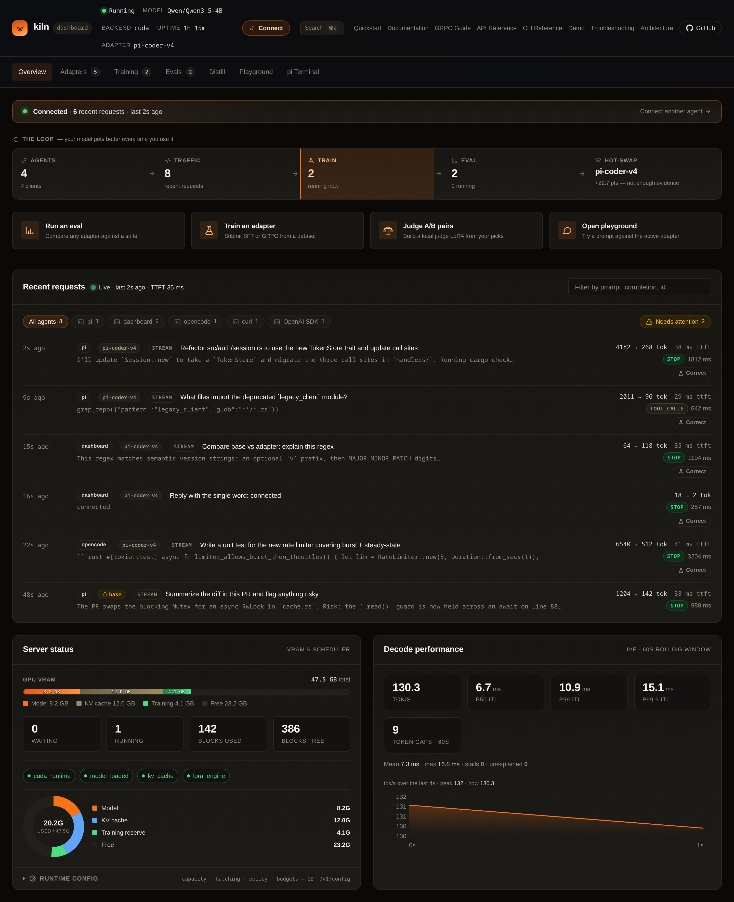
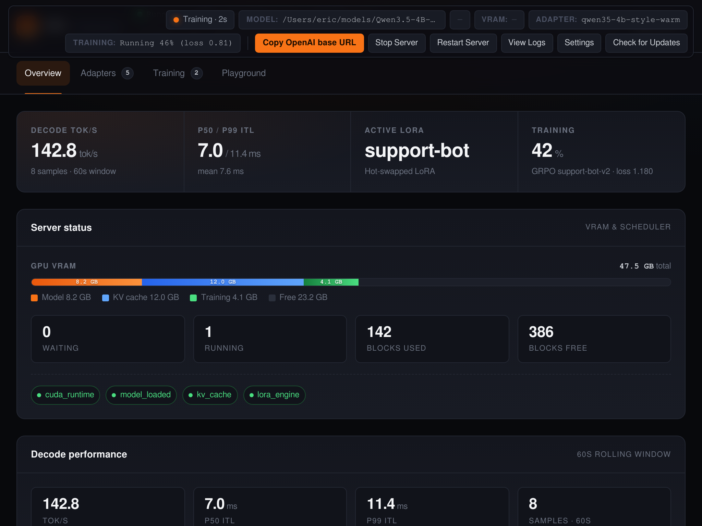
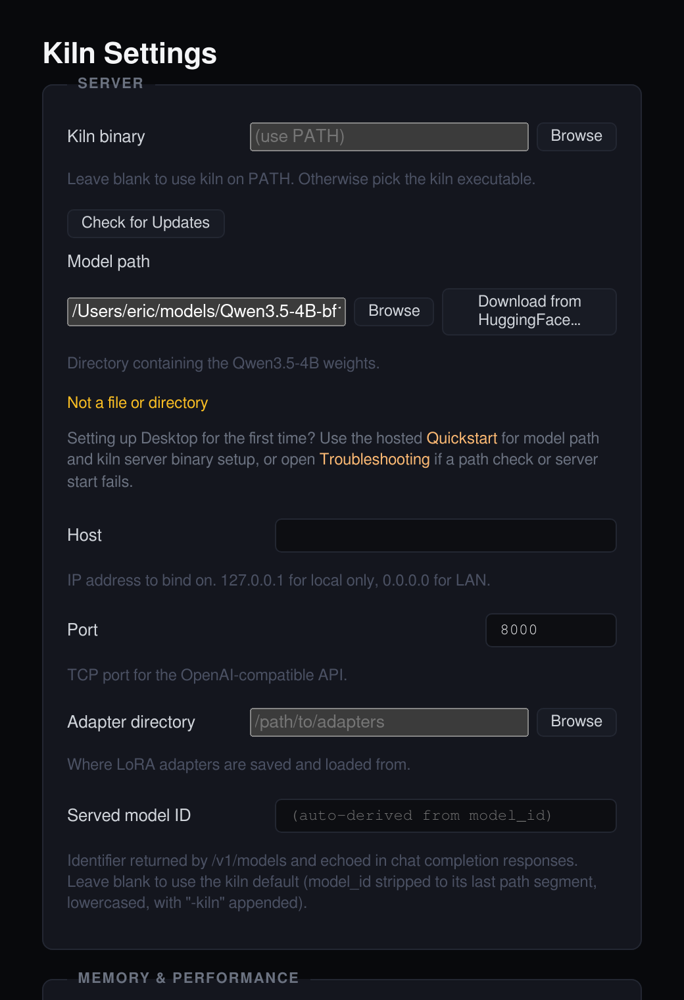
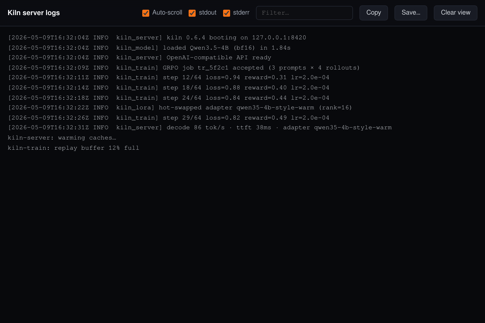

<p align="center">
  
</p>

<h1 align="center">Kiln</h1>

<p align="center">
  <strong>Your model gets better every time you use it.</strong><br>
  A single-GPU inference server with live LoRA training and a first-class eval loop. Pure Rust. Single binary.
</p>

<p align="center">
  <a href="https://ericflo.github.io/kiln/">Website</a> &middot;
  <a href="https://ericflo.github.io/kiln/demo/">Demo</a> &middot;
  <a href="QUICKSTART.md">Quickstart</a> &middot;
  <a href="https://ericflo.github.io/kiln/cli.html">CLI Guide</a> &middot;
  <a href="https://ericflo.github.io/kiln/grpo.html">GRPO Guide</a> &middot;
  <a href="docs/EVAL_GUIDE.md">Eval Guide</a> &middot;
  <a href="https://ericflo.github.io/kiln/api.html">API Reference</a> &middot;
  <a href="https://ericflo.github.io/kiln/troubleshooting.html">Troubleshooting</a> &middot;
  <a href="ARCHITECTURE.md">Architecture</a> &middot;
  <a href="BENCHMARKS.md">Benchmarks</a> &middot;
  <a href="kiln.example.toml">Configuration</a> &middot;
  <a href="CHANGELOG.md">Changelog</a> &middot;
  <a href="CONTRIBUTING.md">Contributing</a> &middot;
  <a href="LICENSE">License</a>
</p>

---

Kiln serves a language model, trains it, and evaluates it — same process, same GPU. You submit corrections or scored completions over HTTP and the model improves in seconds; you upload an SFT dataset and Kiln synthesizes an eval suite from it; you A/B-judge two adapters in the dashboard and your picks become a local judge LoRA. No restarts, no separate training pipeline, no second copy of the weights.

It targets one model ([Qwen3.5-4B](https://huggingface.co/Qwen/Qwen3.5-4B)) and optimizes everything for that model — the scheduler, the memory manager, the kernels. This isn't a general-purpose framework. It's a scalpel.

## Why

Today, improving a deployed model looks like: collect failure examples, format them, upload to a training service, wait hours, download new weights, build a separate eval harness in Python, redeploy, hope. Kiln collapses that into one process — train, evaluate, A/B compare adapters, all over HTTP from the same binary that's serving traffic:

```bash
# Submit a correction — the model learns it in seconds
curl http://localhost:8420/v1/train/sft \
  -H "Content-Type: application/json" \
  -d '{
    "examples": [
      {"messages": [
        {"role": "user", "content": "Summarize this contract clause..."},
        {"role": "assistant", "content": "The clause establishes..."}
      ]}
    ]
  }'

# The next request already uses the updated weights
curl http://localhost:8420/v1/chat/completions \
  -H "Content-Type: application/json" \
  -d '{"messages": [{"role": "user", "content": "Summarize this contract clause..."}]}'

# Did the new adapter actually get better? Run an eval suite against it
curl http://localhost:8420/v1/eval/run \
  -H "Content-Type: application/json" \
  -d '{"suite": "contract-summaries", "adapter": "active"}'
# → Returns a job_id; drill into per-example outcomes at /ui or via
#   GET /v1/eval/jobs/{job_id}. Suites can be hand-authored, synthesized
#   from an uploaded SFT dataset (POST /v1/eval/datasets/.../synthesize),
#   or built up from your A/B picks in the Judgments tab.
```

A 4B model continuously tuned to your specific workload — and continuously *measured* against the prompts you actually care about — will outperform a generic 70B model on those tasks. And it runs on hardware you already own.

## Features

- **OpenAI-compatible API** — drop in as a local replacement. SSE streaming, chat completions, tool use formatting.
- **pi integration** — `kiln pi-setup` backs up and merges `~/.pi/agent/models.json` + `settings.json`, then points pi at Kiln as an OpenAI-compatible tool-calling backend.
- **SFT training** over HTTP — submit examples, model updates in seconds via LoRA hot-swap.
- **GRPO training** over HTTP — submit scored completions for reinforcement learning. You control the reward function.
- **First-class evals** over HTTP — register suites, run them against any adapter, drill into per-example outcomes. Auto-detect picks the right scorer per example (`numeric_tolerance`, `multiple_choice`, `json_validity`, `regex`, `contains`, `tool_call`, `code`, `llm_judge`, `all`/`any` composites).
- **Dataset → eval synthesis** — upload an SFT JSONL and Kiln decomposes it into an eval suite (final-assistant / first-turn / every-turn / tool-call-prediction strategies). No separate eval harness to write.
- **Judgment flywheel** — A/B-judge two adapters in `/ui`, save your picks into a judgment dataset, compile to SFT, train a *local* judge LoRA, validate it on a held-out slice. The dashboard ships a streaming side-by-side viewer with `A`/`B`/`Tie`/`Skip` keyboard shortcuts.
- **Post-training auto-eval** — attach `post_eval` to any SFT/GRPO request and the produced adapter is graded immediately, with results back-linked to the training job.
- **LoRA hot-swap** — new adapter weights activate atomically at iteration boundaries. Zero downtime.
- **Continuous batching** with chunked prefill — decode requests are never stalled by long prompts.
- **128K+ context** on 24GB — Qwen3.5-4B's hybrid architecture (24 linear attention + 8 full attention layers) means KV cache is 4x smaller than a pure transformer.
- **Paged KV cache** — virtual memory-style block allocation eliminates fragmentation.
- **FP8 KV cache** — optional quantization doubles effective context length.
- **Prefix caching** — shared prompt prefixes reuse cached KV blocks.
- **Gradient checkpointing** — training fits on consumer 24GB GPUs (RTX 3090/4090).
- **Adapter management** — load, unload, upload (import), download (export), and version LoRA adapters; click any adapter in `/ui` for its provenance (training history + eval scores against it).
- **Adapter composition** — stack multiple LoRAs per request with per-adapter scaling, or merge them server-side via weighted_average / TIES / concatenation.
- **Embedded web dashboard** at `/ui` — live server status, VRAM donut, adapter cards, training queue with live loss curves, full eval workflow (datasets / suites / jobs / judgments) with drill-in per-example modal, A/B compare playground, and a `⌘K` command palette across all of it. No extra service to run.
- **Prometheus metrics** at `/metrics` — request latency, throughput, training progress, memory usage.
- **Training webhooks** — POST a JSON event to a configured URL on training job completion or failure.
- **Pure Rust** — single binary, single process. No Python. No sidecar. No second model in memory.

## The GRPO Loop

This is the killer feature. Generate completions, score them with your own reward function, and feed the results back. The model learns what "good" means for your use case.

```python
import openai
import requests

client = openai.OpenAI(base_url="http://localhost:8420/v1", api_key="unused")

# 1. Generate candidates
responses = [
    client.chat.completions.create(
        model="qwen3.5-4b-kiln",
        messages=[{"role": "user", "content": prompt}],
        temperature=0.7
    )
    for _ in range(8)
]

# 2. Score them however you want — regex, unit tests, another model, human eval
scored = [{"text": r.choices[0].message.content, "reward": my_score(r)} for r in responses]

# 3. Submit — the server trains and hot-swaps immediately
requests.post("http://localhost:8420/v1/train/grpo", json={
    "groups": [{
        "messages": [{"role": "user", "content": prompt}],
        "completions": scored,
    }]
})

# 4. Next inference already uses the improved weights
```

See [docs/GRPO_GUIDE.md](docs/GRPO_GUIDE.md) for worked verifiable-rewards examples (math, JSON, code).

## The Eval Loop

Training is half the story; the other half is knowing whether your last training run actually helped. Kiln's eval system runs in the same process, against the same model weights, and treats your evals as first-class artifacts — registered suites, drillable per-example outcomes, A/B comparisons across adapters, and a judgment flywheel that turns your A/B picks into a *local* judge LoRA you can re-use.

```bash
# 1. Upload an SFT JSONL — Kiln will use it as the source of truth for examples
curl -F name=customer-support -F format=sft_chat -F file=@my-tickets.jsonl \
  http://localhost:8420/v1/eval/datasets/upload

# 2. Synthesize an eval suite from it (auto-detect picks the right scorer per example)
curl -X POST http://localhost:8420/v1/eval/datasets/customer-support/synthesize \
  -H 'content-type: application/json' \
  -d '{"suite_name":"support-eval","strategy":"final_assistant",
       "scorer":{"kind":"auto_detect"},
       "sampling":{"max_examples":100,"max_prompt_chars":32768,"max_target_chars":4096,"dedupe":true},
       "force":true,"run_against":["v1"]}'

# 3. Compare two adapters head-to-head
curl -X POST http://localhost:8420/v1/eval/compare \
  -H 'content-type: application/json' \
  -d '{"suite":"support-eval","adapters":["v1","v2"]}'

# 4. Drill into per-example outcomes at /ui — pass/fail/invalid badges with prompt + target + got
#    side-by-side, scorer detail, and a one-click "re-run failures" loop.
```

The judgment flywheel runs entirely on your machine — no frontier LLM, no API keys, no telemetry leaving the box. Click two replies in the playground, save them as an A/B preference, compile your picks into SFT data, train a small judge LoRA on them, then use that LoRA as the `judge_adapter` in any `LlmJudge` scorer. The judge gets better the more you use it; bad judgments are removable from the dataset and a retrain wipes their influence.

See [docs/EVAL_GUIDE.md](docs/EVAL_GUIDE.md) for the full scorer reference, dataset synthesis strategies, and the judge-LoRA workflow.

## Quick Start

**Supported hardware:** NVIDIA GPU with 24GB+ VRAM and CUDA 12+, AMD/Intel GPU with Vulkan 1.2+ on Linux, **or** Apple Silicon Mac with 16GB+ unified memory. Kiln targets `Qwen/Qwen3.5-4B` and needs about 20GB of free disk for the server, model weights, and adapters.

**Path 1 — Desktop App (recommended):** Install [Kiln Desktop](#desktop-app) on Windows, Linux, or macOS. The app downloads and verifies the matching prebuilt `kiln` server binary on first launch, then walks you through choosing or downloading `Qwen/Qwen3.5-4B`. No Rust toolchain, CUDA toolkit, or source build is required for this path.

**Get the model weights** (Paths 2–4 share this step; the Desktop App handles it automatically):

```bash
pip install huggingface-hub
huggingface-cli download Qwen/Qwen3.5-4B --local-dir ./Qwen3.5-4B
```

This downloads `Qwen/Qwen3.5-4B` into `./Qwen3.5-4B`, which the commands below reference directly.

**Path 2 — Server binary (terminal-first, no source build):** Download the latest `kiln-v*` server artifact when you want the `kiln` server in your terminal with no source build, Desktop App, or Docker. Linux x86_64 + NVIDIA CUDA 12.4 is the compact path (run the `Qwen/Qwen3.5-4B` weights step above first):

```bash
KILN_VERSION=$(curl -fsSL https://api.github.com/repos/ericflo/kiln/releases/latest | sed -n 's/.*"tag_name": "kiln-v\([^"]*\)".*/\1/p')
curl -L -o kiln-linux-cuda.tar.gz \
  "https://github.com/ericflo/kiln/releases/download/kiln-v${KILN_VERSION}/kiln-${KILN_VERSION}-x86_64-unknown-linux-gnu-cuda124.tar.gz"
tar -xzf kiln-linux-cuda.tar.gz

KILN_MODEL_PATH=./Qwen3.5-4B ./kiln serve
```

For Linux Vulkan, macOS Metal, Windows CUDA, and SHA-256 sidecar checks, use the full release artifact matrix in [QUICKSTART.md](QUICKSTART.md#quick-path-server-binary-terminal-first-no-source-build).

**Path 3 — Container:** Run the prebuilt GHCR image when you prefer containerized deployment. This path requires the [NVIDIA Container Toolkit](https://docs.nvidia.com/datacenter/cloud-native/container-toolkit/latest/install-guide.html). Make sure the weights step above has placed the model under `./Qwen3.5-4B` (or substitute your own absolute path), then mount that directory into the container:

```bash
docker pull ghcr.io/ericflo/kiln-server:latest
docker run --gpus all -p 8420:8420 \
  -e KILN_MODEL_PATH=/models/Qwen3.5-4B \
  -v "$(pwd)/Qwen3.5-4B:/models/Qwen3.5-4B:ro" \
  ghcr.io/ericflo/kiln-server:latest serve
```

Open http://127.0.0.1:8420/ui after the container starts.

**Path 4 — Source / CLI:** Install Rust stable, then build the CLI from source when you are contributing, scripting against a local checkout, or need to test unreleased changes.

```bash
git clone https://github.com/ericflo/kiln.git
cd kiln

# Linux / Windows + NVIDIA
cargo build --release --features cuda     # ~15-30 min first build (CUDA kernels)

# Linux + AMD / Intel
# Requires Vulkan 1.2+ runtime plus glslc or glslangValidator for shader embedding.
cargo build --release --features vulkan   # Vulkan compute kernels via ash + SPIR-V

# macOS + Apple Silicon
cargo build --release --features metal    # Metal backend via candle
```

Start the source-built server (using the weights downloaded above):

```bash
KILN_MODEL_PATH=./Qwen3.5-4B ./target/release/kiln serve
```

Vulkan builds auto-select a Vulkan physical device at startup. Use `KILN_VULKAN_DEVICE=0` to pin a zero-based Vulkan device index, or `GGML_VK_VISIBLE_DEVICES=0,1` to reuse llama.cpp-style visibility; invalid values are ignored with a warning and Kiln falls back to automatic selection or CPU if no Vulkan device is usable.

```
  ┌─────────────────────────────────────┐
  │           🔥 K I L N 🔥             │
  │   inference · training · adapters   │
  └─────────────────────────────────────┘

  Version: <workspace version>
  Mode:    GPU inference
  Model:   ./Qwen3.5-4B
  CUDA:    available ✓
  GPU:     NVIDIA RTX A6000
  VRAM:    49140 MiB total, 48891 MiB free
  Listen:  http://127.0.0.1:8420

  Endpoints: /ui, /v1/chat/completions, /v1/train/sft, /health, /metrics
```

The `GPU` and `VRAM` lines come from `nvidia-smi` and are skipped silently if it isn't installed.

**Verify the server is up.** Run `kiln health` (binary at `./kiln` for Path 2/3 or `./target/release/kiln` for Path 4) before sending real requests — it prints a readable tree with model, scheduler, training, and GPU status, and exits non-zero if anything is wrong. See [troubleshooting](https://ericflo.github.io/kiln/troubleshooting.html#start-with-three-probes) for the full three-probe sequence.

```bash
./kiln health
```

```bash
# Chat
curl http://localhost:8420/v1/chat/completions \
  -H "Content-Type: application/json" \
  -d '{"messages": [{"role": "user", "content": "Hello!"}], "stream": true}'

# Train
curl http://localhost:8420/v1/train/sft \
  -H "Content-Type: application/json" \
  -d '{"examples": [{"messages": [{"role": "user", "content": "Hi"}, {"role": "assistant", "content": "Hey there!"}]}]}'

# Check training
curl http://localhost:8420/v1/train/status
```

**Optional: use Kiln as pi's local agent model.** With the server running on `localhost:8420`, `kiln pi-setup` adds a `kiln-local` provider to pi without deleting your other providers or settings. Existing files are backed up first as `models.json.bak-<timestamp>` and `settings.json.bak-<timestamp>`.

```bash
# Local server
./kiln pi-setup

# Remote office/server box
./kiln pi-setup --kiln-url http://office-kiln:8420

# pi now uses model qwen-3.5-4b-kiln through http://.../v1
pi -p "Use the bash tool to run: pwd"
```

Kiln accepts Qwen3.5's native XML tool-call generations internally, but OpenAI-compatible clients receive normal `tool_calls` in both streaming and non-streaming responses. pi should execute the tool call instead of printing raw `<tool_call>` XML.

See [QUICKSTART.md](QUICKSTART.md) for the full walkthrough including Desktop App setup, source builds, GRPO, adapter management, Docker, and systemd setup. If setup stalls on binary downloads, CUDA/Metal, model paths, `/health`, mock mode, training endpoints, or adapter directories, start with the [Troubleshooting guide](https://ericflo.github.io/kiln/troubleshooting.html). For tools-bearing workloads on older pinned releases, see [QUICKSTART.md §9.2](QUICKSTART.md#92-troubleshooting-older-release-long-prefill-timeouts) for the legacy `workers=1` / request-timeout troubleshooting note ([#664](https://github.com/ericflo/kiln/issues/664)).

## See it in action

Six short asciicasts captured on a single A6000 against `Qwen3.5-4B` show the main developer flows: first token from cold start, benchmark output, LoRA hot-swap, an OpenAI-compatible client, GRPO with a custom reward, and the full SFT online-learning loop. Watch them in the embedded player at **[ericflo.github.io/kiln/demo/](https://ericflo.github.io/kiln/demo/)** or browse the recording scripts and reference shell drivers under [`docs/site/demo/`](docs/site/demo/).

The kiln server also ships an embedded web dashboard at `http://localhost:8420/ui` with live decode tok/s, p50/p99 ITL, VRAM breakdown, adapter management, training monitoring, and a chat playground — no extra service to run.

Here is the embedded server dashboard running with healthy status, active adapters, training progress, and the chat playground in one view:



## Memory Budget (24GB GPU)

Qwen3.5-4B's hybrid architecture is the key. Only 8 of 32 layers need KV cache, so long-context inference costs a fraction of what a pure transformer would.

| Scenario | Total VRAM | Fits 24GB? |
|---|---|---|
| 128K context, 1 sequence, inference only | ~13 GB | Yes |
| 128K context, 1 sequence, inference + training | ~18 GB | Yes |
| 64K context, 4 sequences, inference + training | ~22 GB | Yes |
| 32K context, 8 sequences, inference + training | ~22 GB | Yes |
| 128K context, 4 sequences, FP8 KV cache | ~19 GB | Yes |

### Apple Silicon (M3 Max / M4 Max 64GB unified memory)

On Apple Silicon, model weights, KV cache, and training state all live in unified memory shared with the OS. A 64 GB chip leaves generous headroom for long contexts and concurrent training.

| Scenario | Unified Memory | Fits 64GB? |
|---|---|---|
| 128K context, 1 sequence, inference only | ~13 GB | Yes |
| 128K context, 1 sequence, inference + training | ~18 GB | Yes |
| 64K context, 4 sequences, inference + training | ~22 GB | Yes |
| 128K context, 8 sequences, inference + training | ~32 GB | Yes |
| 128K context, 4 sequences, FP8 KV cache | ~19 GB | Yes |

16 GB M-series chips fit short-context inference; 32 GB fits 64K context comfortably; 64 GB+ matches or exceeds the 24 GB CUDA envelope.

## API

| Method | Path | Description |
|---|---|---|
| POST | `/v1/chat/completions` | Chat completions (OpenAI-compatible) |
| POST | `/v1/completions/batch` | Batch generation API for GRPO (up to 64 prompts per request) |
| POST | `/v1/train/sft` | Submit SFT training examples (optionally with a `post_eval` hook) |
| POST | `/v1/train/grpo` | Submit GRPO scored completions (optionally with a `post_eval` hook) |
| GET | `/v1/train/status` | Training queue and job status |
| GET | `/v1/train/status/{job_id}` | Inspect one training job |
| GET | `/v1/train/jobs/{job_id}` | Rich training job detail (loss curve + linked-eval back-references) |
| GET | `/v1/train/queue` | List queued training jobs |
| DELETE | `/v1/train/queue/{job_id}` | Cancel a queued job |
| GET | `/v1/adapters` | List saved/available LoRA adapters and identify the active adapter |
| GET | `/v1/adapters/{name}/detail` | Files + training history + eval history for one adapter |
| POST | `/v1/adapters/load` | Load adapter from disk |
| POST | `/v1/adapters/unload` | Unload active adapter |
| DELETE | `/v1/adapters/{name}` | Delete an adapter |
| POST | `/v1/adapters/upload` | Multipart tar.gz import of an adapter |
| GET  | `/v1/adapters/{name}/download` | Stream adapter as tar.gz (export) |
| POST | `/v1/adapters/merge` | Merge adapters (weighted_average, TIES, or concatenation modes) |
| GET / POST | `/v1/eval/suites` | List or register eval suites (body = `EvalSuite`) |
| GET / DELETE | `/v1/eval/suites/{name}` | Fetch / delete one suite |
| POST | `/v1/eval/run` | Submit an eval (registered suite or inline) |
| POST | `/v1/eval/compare` | Run a suite across multiple adapters head-to-head |
| GET | `/v1/eval/jobs` | List all eval jobs |
| GET / DELETE | `/v1/eval/jobs/{job_id}` | Per-job status + outcomes / cancel |
| POST | `/v1/eval/jobs/{job_id}/rerun` | Re-run only the failing examples from a completed job |
| POST | `/v1/eval/datasets/upload` | Multipart upload of an SFT/GRPO JSONL dataset |
| GET / DELETE | `/v1/eval/datasets/{name}` | Dataset manifest / delete |
| GET | `/v1/eval/datasets/{name}/rows` | Stream first N rows (used by the SFT submit form's dataset picker) |
| POST | `/v1/eval/datasets/{name}/preview` | Preview synthesized examples before committing |
| POST | `/v1/eval/datasets/{name}/synthesize` | Decompose a dataset into an eval suite |
| GET / POST | `/v1/judgments` | List or create judgment datasets |
| DELETE | `/v1/judgments/{name}` | Delete a judgment dataset |
| POST | `/v1/judgments/{name}/rows` | Append one A/B/Tie/Skip preference |
| DELETE | `/v1/judgments/{name}/rows/{id}` | Prune a bad row (then retrain to wipe its influence) |
| POST | `/v1/judgments/{name}/compile` | Compile judgments into an SFT dataset for training a judge LoRA |
| POST | `/v1/judgments/{name}/validate` | Score a judge LoRA against a held-out judgment slice |
| POST | `/v1/judgments/render_prompt` | Render the canonical pairwise judging prompt (debug aid) |
| GET | `/v1/models` | List available models |
| GET | `/v1/config` | Current server configuration |
| GET | `/ui` | Embedded web dashboard (Overview / Adapters / Training / Evals / Playground) |
| GET | `/v1/stats/decode` | Live decode tokens/sec and inter-token latency stats used by the dashboard |
| GET | `/v1/stats/recent-requests` | Bounded recent chat-completion history for the dashboard's request panel |
| GET | `/health` | Server health and diagnostics |
| GET | `/v1/health` | /v1 compatibility alias for health and diagnostics |
| GET | `/metrics` | Prometheus metrics |

## Architecture

```
Single Rust binary:
  HTTP (axum) ─── Scheduler (continuous batching, chunked prefill)
                      │
                  Block Manager (paged KV cache)
                      │
                  Engine (model forward + LoRA)
                  ├── 24× Gated DeltaNet layers (linear attention, O(1) state)
                  └──  8× GQA layers (full attention + KV cache)
                      │
                      ├── Training worker (background thread, shares GPU)
                      │   ├── SFT (cross-entropy on LoRA parameters)
                      │   └── GRPO (advantage-weighted policy gradient)
                      │
                      └── Eval worker (background thread, shares GPU)
                          ├── Suite registry + dataset registry + judgment store on disk
                          ├── Pluggable scorers (auto-detect, exact, regex, JSON,
                          │   numeric, MCQ, contains, tool_call, code, llm_judge, all/any)
                          └── Post-training auto-eval hook
```

Everything runs in one process. Training and evaluation share the already-loaded model — no second copy in VRAM, no Python sidecar, no frontier-LLM dependency for judging.

See [ARCHITECTURE.md](ARCHITECTURE.md) for the full deep-dive.

## Project Structure

```
crates/
  kiln-core/             Core types: block manager, prefix cache, config, request lifecycle
  kiln-model/            Model loading, forward pass, LoRA, sampling
  kiln-scheduler/        Continuous batching scheduler with chunked prefill
  kiln-server/           HTTP server, CLI, training queue, eval queue, metrics, config
  kiln-train/            SFT and GRPO training loops with gradient checkpointing
  kiln-eval/             Suites, scorers, results, dataset → eval synthesis (pure CPU, no GPU dep)
  kiln-nvtx/             Thin NVTX range wrapper for nsys attribution (no-op when off)
  kiln-flce-kernel/      Fused Linear Cross-Entropy (chunked CE without [T, V] logits)
  kiln-flash-attn/       Vendored Flash-Attention-2 CUDA kernels (C-ABI + Rust FFI) [CUDA only]
  kiln-gdn-kernel/       Vendored Gated DeltaNet chunkwise + recurrent kernels [CUDA only]
  kiln-vulkan-kernel/    Vulkan compute shaders for AMD/Intel GDN hot paths [Vulkan only]
  kiln-conv1d-kernel/    Vendored mamba-ssm causal_conv1d_update decode kernel [CUDA only]
  kiln-rmsnorm-kernel/   Fused RMSNorm CUDA kernel (Liger-style) [CUDA only]
  kiln-marlin-gemm/      Vendored IST-DASLab Marlin W4A16 GEMM kernel [CUDA only]
```

## Configuration

Kiln uses a TOML config file. Environment variables override config values. See [`kiln.example.toml`](kiln.example.toml) for all options.

| Setting | Env Var | Default | Description |
|---|---|---|---|
| `model.path` | `KILN_MODEL_PATH` | — | Path to model weights (required) |
| `server.port` | `KILN_PORT` | 8420 | Server listen port |
| `memory.inference_memory_fraction` | — | 0.7 | VRAM fraction for inference vs training |
| `memory.kv_cache_fp8` | `KILN_KV_CACHE_FP8` | false | FP8 KV cache (2x context length) |
| `logging.format` | `KILN_LOG_FORMAT` | auto | `auto` (default; pretty on TTY, JSON otherwise), `json`, `pretty`, `text`, or `human` |
| `prefix_cache.enabled` | `KILN_PREFIX_CACHE_ENABLED` | true | Reuse KV cache for shared prefixes |
| `prefix_cache.max_entries` | `KILN_PREFIX_CACHE_MAX_ENTRIES` | auto | Cap cached GDN state snapshots (~49 MiB each; auto budget ≤1 GiB) |

## Security model

Kiln has no built-in auth. The default listen address is `127.0.0.1:8420` so a fresh install isn't reachable from the network. To accept remote connections, set `server.host = "0.0.0.0"` (or `KILN_HOST=0.0.0.0`) and front kiln with a reverse proxy (nginx, Caddy) that adds auth, or run it on a private network (WireGuard, Tailscale).

**Training data is privileged.** Kiln applies a faithful gradient update to anything you POST to `/v1/train/sft` or `/v1/train/grpo` — it validates structure, not semantics. A poisoned training example will permanently influence the active adapter until you unload or reset it. Treat your training corpus as security-sensitive: do not accept training data from untrusted sources, and review examples before submission the same way you would review code before merging it.

Adapters are easy to revert if a bad training run lands. `POST /v1/adapters/unload` deactivates the current adapter; `DELETE /v1/adapters/{name}` removes it from disk. The base model is unaffected — only LoRA deltas are written.

Full v0.1 threat model and per-finding analysis: [`docs/audits/security-audit-v0.1.md`](docs/audits/security-audit-v0.1.md).

## Desktop App

Kiln Desktop is a system-tray app that wraps the `kiln` server for people who don't want to use a CLI. It spawns and supervises the `kiln` binary as a child process, shows server status in the tray, and opens a dashboard, settings, and log viewer in native windows.

**Windows, Linux, and macOS (Apple Silicon).** Windows drives the CUDA build of `kiln`; Linux chooses CUDA on NVIDIA systems and Vulkan on AMD/Intel systems; macOS drives the candle-metal build on M-series hardware. Intel Macs are not supported.

**Download — [Kiln Desktop v0.2.16](https://github.com/ericflo/kiln/releases/tag/desktop-v0.2.16):**

**Release note:** Desktop and server binaries use separate GitHub release tags/version numbers. `desktop-v0.2.16` is the latest Desktop release; it downloads and verifies the matching server binary from the latest `kiln-v*` release line, so the version split is intentional.

See **[desktop/CHANGELOG.md](desktop/CHANGELOG.md)** for the full version history.

| Platform | Installer | Size |
|---|---|---|
| macOS (Apple Silicon) | [Kiln.Desktop_0.2.16_aarch64.dmg](https://github.com/ericflo/kiln/releases/download/desktop-v0.2.16/Kiln.Desktop_0.2.16_aarch64.dmg) | 8.5 MB |
| Windows | [Kiln.Desktop_0.2.16_x64-setup.exe](https://github.com/ericflo/kiln/releases/download/desktop-v0.2.16/Kiln.Desktop_0.2.16_x64-setup.exe) (NSIS) | 4.5 MB |
| Windows | [Kiln.Desktop_0.2.16_x64_en-US.msi](https://github.com/ericflo/kiln/releases/download/desktop-v0.2.16/Kiln.Desktop_0.2.16_x64_en-US.msi) (MSI) | 6.8 MB |
| Linux | [Kiln.Desktop_0.2.16_amd64.deb](https://github.com/ericflo/kiln/releases/download/desktop-v0.2.16/Kiln.Desktop_0.2.16_amd64.deb) | 8.8 MB |
| Linux | [Kiln.Desktop_0.2.16_amd64.AppImage](https://github.com/ericflo/kiln/releases/download/desktop-v0.2.16/Kiln.Desktop_0.2.16_amd64.AppImage) | 85.7 MB |

The installer bundles the desktop wrapper only. On first launch the app offers to auto-download the matching prebuilt `kiln` server binary for your platform (macOS aarch64 / Metal, Linux x86_64 / CUDA 12.4 or Vulkan, Windows x86_64 / CUDA 12.4) from the latest `kiln-v*` GitHub release and verify it against the published SHA-256. You can also point it at an existing `kiln` binary from Settings. Model weights still need to be downloaded separately — the Settings window has a HuggingFace downloader, or you can use the CLI path in [QUICKSTART.md](QUICKSTART.md).

**Dashboard** — a toolbar across the top surfaces server state, model path, VRAM usage, active LoRA adapter, training status, and the OpenAI base URL as click-to-copy pills, alongside Start / Stop / Restart Server, View Logs, and Settings buttons. A first-run empty state walks you through setting a model path, and if the kiln server crashes while the dashboard is open an error screen surfaces it with a one-click recovery path. Keyboard shortcuts cover the common actions — <kbd>Ctrl/Cmd</kbd>+<kbd>Shift</kbd>+<kbd>S</kbd> to start, <kbd>Ctrl/Cmd</kbd>+<kbd>Shift</kbd>+<kbd>.</kbd> to stop, <kbd>Ctrl/Cmd</kbd>+<kbd>Shift</kbd>+<kbd>R</kbd> to restart, <kbd>Ctrl/Cmd</kbd>+<kbd>Shift</kbd>+<kbd>C</kbd> to copy the base URL, <kbd>Ctrl/Cmd</kbd>+<kbd>L</kbd> for logs, <kbd>Ctrl/Cmd</kbd>+<kbd>,</kbd> for settings, and <kbd>?</kbd> for the full cheatsheet modal. The toolbar wraps gracefully at narrow window widths, and the kiln server's `/ui` is embedded below.



**Settings** — pick a model path (or pull weights with the built-in HuggingFace downloader), configure the listening host and port, and tune the runtime: inference VRAM fraction, FP8 KV cache, CUDA graphs, prefix cache, and adapter directory. Startup options cover auto-start kiln on app launch, auto-restart on crash, and launch-at-login. A Check for Updates button (with the same check running automatically on launch) surfaces new `kiln-v*` releases and explains when an update is held back for CUDA driver or GPU SM-arch compatibility reasons.



**Logs** — tails the kiln server's stdout/stderr from an in-process ring buffer.



Build and dev docs for the desktop app live in [desktop/README.md](desktop/README.md).

## Deployment

### Docker — pull a prebuilt image

Each `kiln-v*` tag publishes a `linux/amd64` CUDA 12.4 image to GHCR:

```bash
docker pull ghcr.io/ericflo/kiln-server:latest
# or pin the current latest version programmatically:
KILN_VERSION=$(curl -fsSL https://api.github.com/repos/ericflo/kiln/releases/latest | sed -n 's/.*"tag_name": "kiln-v\([^"]*\)".*/\1/p')
docker pull ghcr.io/ericflo/kiln-server:${KILN_VERSION}
```

Run with the [NVIDIA Container Toolkit](https://docs.nvidia.com/datacenter/cloud-native/container-toolkit/latest/install-guide.html):

```bash
docker run --gpus all -p 8420:8420 \
  -e KILN_MODEL_PATH=/models/Qwen3.5-4B \
  -v /path/to/Qwen3.5-4B:/models/Qwen3.5-4B:ro \
  ghcr.io/ericflo/kiln-server:latest serve
```

### Docker — build from source

```bash
docker build -f deploy/Dockerfile -t kiln .
docker run --gpus all -p 8420:8420 \
  -e KILN_MODEL_PATH=/models/Qwen3.5-4B \
  -v /path/to/Qwen3.5-4B:/models/Qwen3.5-4B:ro \
  kiln serve
```

### systemd

```bash
sudo cp target/release/kiln /usr/local/bin/
sudo cp deploy/kiln.service /etc/systemd/system/
sudo systemctl enable --now kiln
```

## Status

Kiln v0.1.0 shipped on 2026-04-19 and the current release line follows the latest `kiln-v*` GitHub release. Phases 1–10 are shipped or chapter-closed: core inference, LoRA serving, SFT and GRPO training over HTTP, production hardening, the Phase 6 performance sprint (FP8 KV cache, CUDA graphs, GPTQ + Marlin W4A16 quantization, fused decode kernels, SGLang-style radix prefix cache), Phase 7 developer experience, Phase 8 advanced features (adapter upload/download, TIES + concatenation merge modes, per-request adapter composition, batch completions for GRPO, training webhooks), Phase 9 public-release prep (Sigstore-signed provenance, GHCR image, signed binaries for Linux/macOS/Windows), and Phase 10 Liger-style long-context training kernels (closed by [`docs/audits/PHASE10_CLOSURE.md`](docs/audits/PHASE10_CLOSURE.md)). Inference on macOS / Apple Silicon runs via the candle-metal backend, with a fused Metal kernel family landed in v0.2.0. Phase 11 — onboarding, the first-class eval system (suites, scorers, dataset → eval synthesis, judgment flywheel, post-training auto-eval), and the dashboard overhaul (drill-in modals, live loss curves, A/B compare, ⌘K command palette) — is the active line. See [`CHANGELOG.md`](CHANGELOG.md) for what landed in the most recent release and [`BENCHMARKS.md`](BENCHMARKS.md) for current decode numbers.

Not yet production-hardened for multi-tenant use. Designed for single-user, single-GPU deployments — your home server, your dev box, your dedicated cloud instance.

## Prior Art

Kiln builds on ideas from:

- [vLLM](https://github.com/vllm-project/vllm) — paged KV cache, continuous batching
- [DeepSeekMath](https://arxiv.org/abs/2402.03300) — GRPO algorithm
- [S-LoRA](https://arxiv.org/abs/2311.03285) — multi-LoRA serving techniques
- [Tinker](https://thinkingmachines.ai/blog/announcing-tinker/) — the cloud-hosted version of this idea. Kiln is the self-hosted, open-source take.
- [nano-vllm](https://github.com/GeeeekExplorer/nano-vllm) — proof that the core can be simple

## Contributing

Bug reports, performance work, kernel ports, documentation, and dev-experience polish are all welcome. Issues live at [github.com/ericflo/kiln/issues](https://github.com/ericflo/kiln/issues); read [CONTRIBUTING.md](CONTRIBUTING.md) before opening a non-trivial PR — Kiln is a deliberate scalpel (Qwen3.5-4B only, single-binary, no Python sidecar) and a 5-minute scope conversation up front saves a 5-day rewrite later. Performance changes should attach a `kiln-bench` median-of-3 run; kernel changes should cite the closed-PR history first.

Maintained by [@ericflo](https://github.com/ericflo). MIT-licensed.

## License

MIT — see [LICENSE](LICENSE).

Third-party dependency licenses: see [THIRD_PARTY_LICENSES.md](THIRD_PARTY_LICENSES.md).
